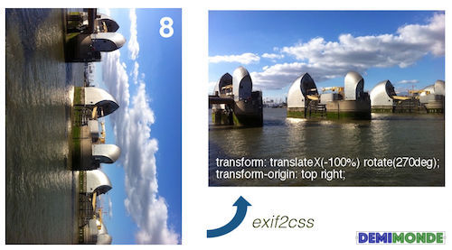
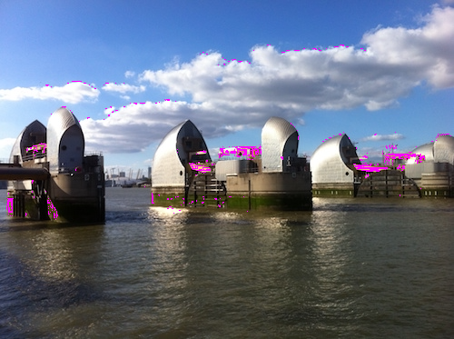

# exif2css

[](https://npmjs.org/package/exif2css)

`exif2css` Converts EXIF Orientation To CSS Transform Rules (in 772 bytes gzipped).

```sh
yarn add -E exif2css
```



## Table Of Contents

- [Table Of Contents](#table-of-contents)
- [API](#api)
- [`exif2css(orientation: (number|string)): Exif2CssReturn`](#exif2cssorientation-numberstring-exif2cssreturn)
  * [`Exif2CssReturn`](#type-exif2cssreturn)
- [Usage](#usage)
  * [As Node Module](#as-node-module)
  * [As Script](#as-script)
- [Testing](#testing)
- [Copyright](#copyright)

<p align="center"><a href="#table-of-contents"></a></p>

## API

The package is available by importing its default function:

```js
import exif2css from 'exif2css'
```

<p align="center"><a href="#table-of-contents"></a></p>

## `exif2css(`<br/>&nbsp;&nbsp;`orientation: (number|string),`<br/>`): Exif2CssReturn`

Converts an integer or a string representing EXIF orientation into required CSS with _transfrom_ and optionally _transform-origin_ properties. They can then be used as needed, possibly prefixing the rules with browser-specific tags (e.g., `-webkit-transform` and `-webkit-transform-origin`).

One known issue is that with orientations > 4, the transformed image will have different dimensions from its box, so that whitespace might appear on the right and at the bottom of the image.

```js
import exif2css from 'exif2css'

['not-an-exif-orientation', 1,2,3,4,5,6,7,8]
  .forEach((i) => {
    console.log('Orientation: %s', i)
    const result = exif2css(i)
    console.log(result)
    console.log()
  })
```
```js
Orientation: not-an-exif-orientation
{}

Orientation: 1
{}

Orientation: 2
{ transform: 'rotateY(180deg)',
  transforms: { rotateY: 180 },
  transformStrings: { rotateY: 'rotateY(180deg)' } }

Orientation: 3
{ transform: 'rotate(180deg)',
  transforms: { rotate: 180 },
  transformStrings: { rotate: 'rotate(180deg)' } }

Orientation: 4
{ transform: 'rotate(180deg) rotateY(180deg)',
  transforms: { rotate: 180, rotateY: 180 },
  transformStrings: { rotate: 'rotate(180deg)', rotateY: 'rotateY(180deg)' } }

Orientation: 5
{ transform: 'rotate(270deg) rotateY(180deg)',
  'transform-origin': 'top left',
  transforms: { rotate: 270, rotateY: 180 },
  transformStrings: { rotate: 'rotate(270deg)', rotateY: 'rotateY(180deg)' } }

Orientation: 6
{ transform: 'translateY(-100%) rotate(90deg)',
  'transform-origin': 'bottom left',
  transforms: { translateY: -1, rotate: 90 },
  transformStrings: { translateY: 'translateY(-100%)', rotate: 'rotate(90deg)' } }

Orientation: 7
{ transform: 'translateY(-100%) translateX(-100%) rotate(90deg) rotateY(180deg)',
  'transform-origin': 'bottom right',
  transforms: { translateY: -1, translateX: -1, rotate: 90, rotateY: 180 },
  transformStrings: 
   { translateY: 'translateY(-100%)',
     translateX: 'translateX(-100%)',
     rotate: 'rotate(90deg)',
     rotateY: 'rotateY(180deg)' } }

Orientation: 8
{ transform: 'translateX(-100%) rotate(270deg)',
  'transform-origin': 'top right',
  transforms: { translateX: -1, rotate: 270 },
  transformStrings: { translateX: 'translateX(-100%)', rotate: 'rotate(270deg)' } }
```

__<a name="type-exif2cssreturn">`Exif2CssReturn`</a>__: The return type of the function.

|       Name       |                                    Type                                     |                                                      Description                                                       |
| ---------------- | --------------------------------------------------------------------------- | ---------------------------------------------------------------------------------------------------------------------- |
| transform        | _string_                                                                    | The complete CSS `transform` rule that contains all transforms.                                                        |
| transform-origin | _('top left'\|'top right'\|'bottom left'\|'bottom right')_                  | The transform origin CSS rule for orientations >= 5.                                                                   |
| transforms       | _{translateY: number, translateX: number, rotate: number, rotateY: number}_ | The raw transforms as numbers, where translates are either `-1` or `1` and rotations are either `90`, `180` and `270`. |
| transformStrings | _{translateY: string, translateX: string, rotate: string, rotateY: string}_ | The transforms split by individual rules that can be applied in the browser.                                           |

<p align="center"><a href="#table-of-contents"></a></p>

## Usage

The module can be either required in _Node.JS_, or downloaded as the compiled file from the _dist_ folder and inserted on the webpage.

<p align="center"><a href="#table-of-contents"></a></p>

### As Node Module

The package is published both as CommonJS module with the `main` field, and as a ES6 module with the `module` field. Node will automatically pick up the `main` version, whereas some bundles will be able to use the module.

```bash
yarn add -E exif2css
npm i exif2css
```

```js
import exif2css from 'exif2css' // or
const exif2css = require('exif2css')

const css = exif2css(6)
```

<p align="center"><a href="#table-of-contents"></a></p>

### As Script

_Exif2Css_ has been compiled with [_Depack_](https://github.com/dpck/depack) using Google Closure Compiler. Download the [file](https://github.com/demimonde/exif2css/blob/master/dist/exif2css.js) manually and embed it on the webpage.

```html

<script src="exif2css.js"></script>
<script>
  var img = document.querySelector('img')
  var orientation = 6
  var css = exif2css(orientation)

  if (css.transform) {
      img.style.transform = css.transform
  }
  if (css['transform-origin']) {
      img.style['transform-origin'] = css['transform-origin']
  }
</script>
```

<p align="center"><a href="#table-of-contents"></a></p>

## Testing

The module has been automatically tested in Chrome by inserting pre-compiled images with set orientation, applying generated styles from `exif2css`, taking screenshots and comparing them against the expected image, therefore everything works properly.



<p align="center"><a href="#table-of-contents"></a></p>

## Copyright

(c) [Demimonde][1] 2019

[1]: https://demimonde.cc

<p align="center"><a href="#table-of-contents"></a></p>